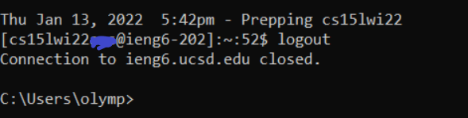
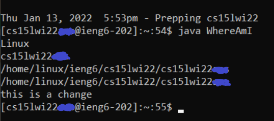
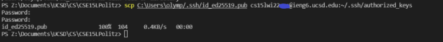

# Lab Report 1 - Remote Access
[Back](https://bimai25.github.io/cse15l-lab-reports/index.html)
## Installing VS Code
- Head to [VS Code](https://code.visualstudio.com/) and download the version of VS Code best suited for your computer

- Upon opening VS Code, the startup should look similar to this:

## Remotely Connecting
 - In order to remotely connect, you must find your @ieng6 account associated with your Student ID [here](https://sdacs.ucsd.edu/~icc/index.php)
 - Every account will be of the form **cse15lwi*xyz*@ieng6.ucsd.edu** where *xyz* is the ID specific to your account
    - You may have to change your password to activate your ieng6 account and this change may take  acouple of minutes to apply
- Open a command terminal and type `ssh <your @ieng6.ucsd.edu account>`, hit enter, type in your password, and then answer yes to any pop-up question. If completed correctly, the terminal should look like this:

## Trying Some Commands
- When logged into the UCSD server there are a number of commands that can be used, many similar to ones that can be used in the standard terminal
    - **Note:** The server runs on Linux so commands must be Linux commands
- Try `ls` which displays all the files in the directory
- `cd <directory name>` will change the current directory
- Typing `logout` will log you out of the server which will look like this

## Moving Files With scp
- Files can be moved from your personal computer to the server to be run using the `scp` command
- Running `scp <file name><ieng6 account>:~/.` will copy the file from your computer to the UCSD server
    - **Note:** make sure your client directory is set to the folder the file is before running `scp`

- On the server, you can run your traditional `javac` and `java` commands, or run `vim <file name>` to ensure the file copied over correctly (as it prints the contents of the file). 

## Setting an SSH Key
- Setting up an SSH key allows us to log into our @ieng6 accounts without repeatedly typing in our password by generating a pair of keys (one of which will be uploaded to the UCSD server) which can be checked against each other for authentication
- Run `ssh-keygen` and note the public key folder location
- Run the following commands to add the public key to the UCSD server: `ssh <ieng6 account>`, `mkdir .ssh`, `logout`, `scp <public file location> <ieng6 account>:~/.ssh/authorized_keys`
    - **Note:** On Windows the ssh key may save to an odd folder because `ssh-keygen -t ed25519` has to be run to generate SSH keys

## Optimizing Remote Running
- Commands can be strung together to be run sequentially by separating them with a semicolon in the command line
- Running `ssh <ieng6 account>` and putting a command in quotation mamarkers krs will immediately run the command on the UCSD server `ssh <ieng6 account> "ls -a"`
    - Ex: `ssh <ieng6 account> javac WhereAmI.java ; java WhereAmI` will compile and run the java file `WhereAmI.java` on the server
    
- Hitting the up and down arrow keys will rotate through recently run comamnds if you have to resuse commands
