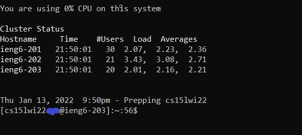

# Lab Report 1 - Remote Access

## Installing VS Code
- Head to [VS Code](https://code.visualstudio.com/) and download the version of VS Code best suited for your computer

- Upon opening VS Code, the startup should look similar to this:

## Remotely Connecting
 - In order to remotely connect, you must find your @ieng6 account associated with your Student ID [here](https://sdacs.ucsd.edu/~icc/index.php)
 - Every account will be of the form **cse15lwi*xyz*@ieng6.ucsd.edu** where *xyz* is the ID specific to your account
    - You may have to change your password to activate your ieng6 account and this change may take  acouple of minutes to apply
- Open a command terminal and type `ssh <your @ieng6.ucsd.edu account>`, hit enter, type in your password, and then answer yes to any pop-up question. If completed correctly, the terminal should look like this:
