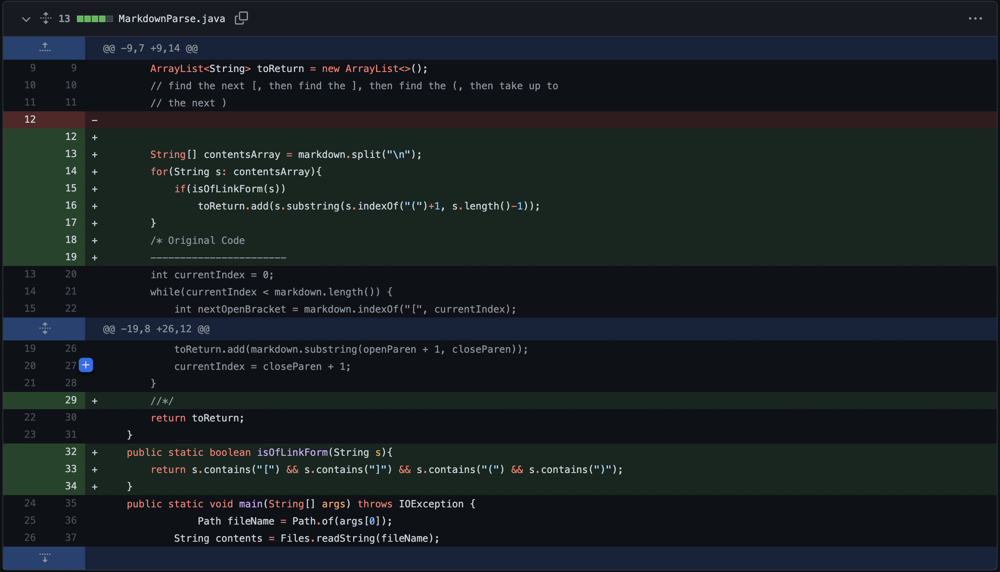
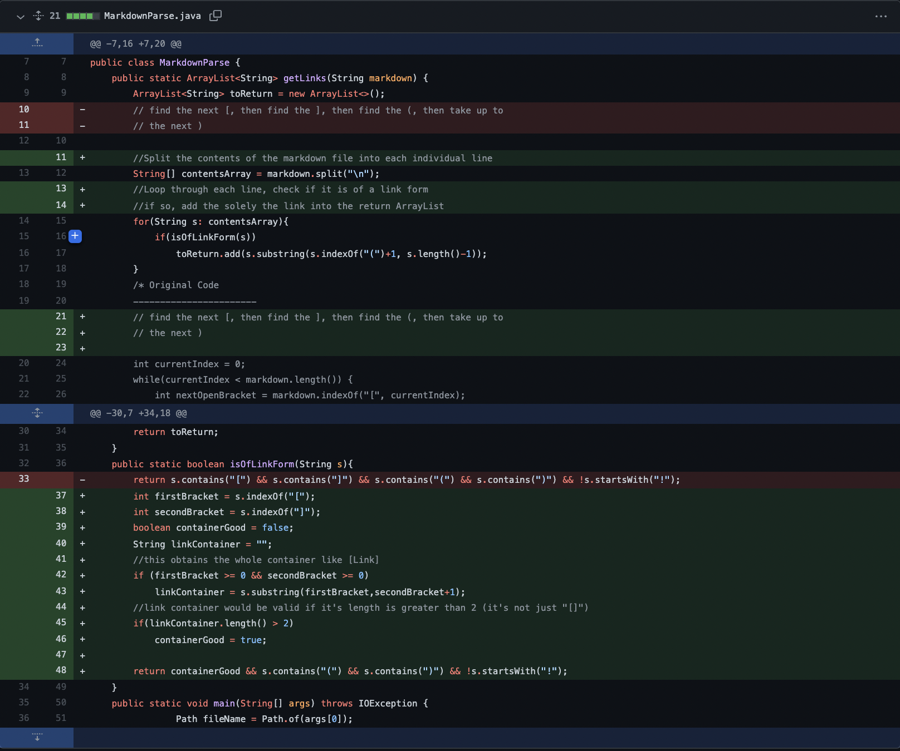
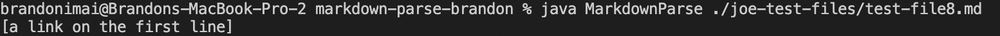

# Lab Report 2 - When Tests Accumulate
[Back](https://bimai25.github.io/cse15l-lab-reports/index.html)
## Code Change 1

Link to failure inducing file: [Test File 4](https://github.com/bimai25/markdown-parse/blob/421b0c655afb2343914d2a804bd052b2fd0fd371/test-file4.md)
### Failing Output

In the original implementation of `MarkdownParse.java`, the code would look for the first instance of an open bracket, then a close bracket, then an open parenthesis, and then a closed parenthesis. This, however, would create problems if the link itself contained brackets or parentheses as the code would think those characters enclose the link. `test-file4.md` contains links with parenthesis and also an image address, which should not show up in the output of `MarkdownParse.java` leading to an incorrect ouptut.

---
## Code Change 2

Link to failure inducing file: [Joe's Test File 6](https://github.com/bimai25/markdown-parse/blob/6f58561d0cba272ea41b8b7944611ead6a83f9ef/joe-test-files/test-file6.md)
### Failing Output

The new implementation of `MarkdownParse.java` incudes a helper method `isOfLinkForm` which fixes the problem of the code breaking when there are brackets or parentheses in the links. However, the code incorrectly prints an image link as seen in the image when `MarkdownParse` runs on Joe's `test-file6.md`. The output should have been an empty array of no links.

---
## Code Change 3

Link to failure inducing file: [Joe's Test File 8](https://github.com/bimai25/markdown-parse/blob/290d6b064c6037beb40367f502cb17c8e8f524d9/joe-test-files/test-file8.md)
### Failing Output

An update to the helper method `isOfLinkForm` fixes the issue where images were added as links. However, the instance where a link is not specified in the double brackets, e.g `[Link](something.com)`is a properly formatted link while `` is not a properly formated link, includes the url in the return statement. `test-file8.md` returns the url when it should return an empty array because it is not fully formatted as a link.