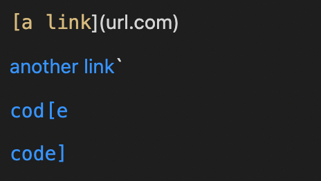
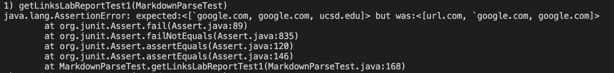
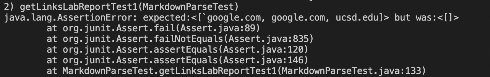
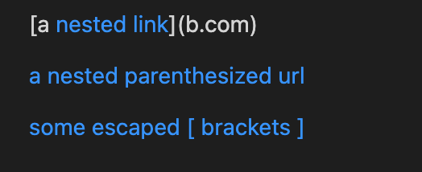
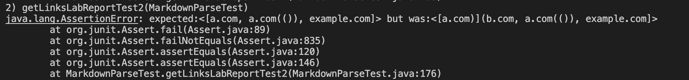
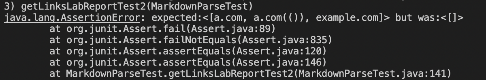
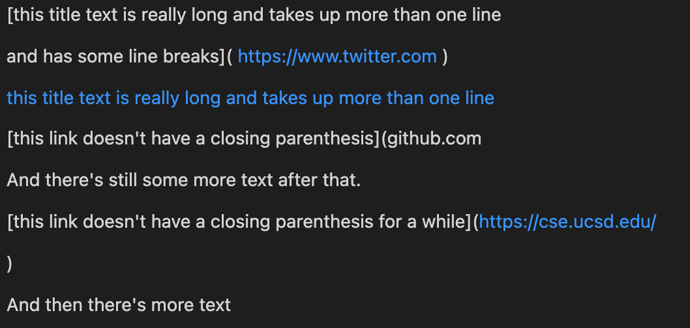
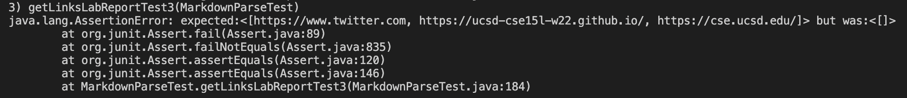
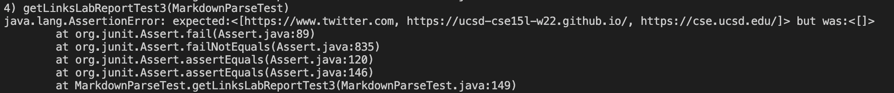

# Lab Report 4 - Week 8 Testing
[Back](https://bimai25.github.io/cse15l-lab-reports/index.html)

## Repositories
[My Repository](https://github.com/bimai25/markdown-parse-brandon)

[Reviewed Repository](https://github.com/AnniePhan02/CSE15L-Panther)

## Snippet 1
### Markdown Preview

### JUnit Tester Code
```
@Test
    public void getLinksLabReportTest1() throws IOException{
        Path fileName = Path.of("./lab-report-test-files/test-1.md");
        String contents = Files.readString(fileName);
        assertEquals(List.of("`google.com", "google.com", "ucsd.edu"),
            MarkdownParse.getLinks(contents));
    }
```
### My Implementation Tester Output

### Reviewed Implementation Tester Output


## Snippet 2
### Markdown Preview

### JUnit Tester Code
```
@Test
    public void getLinksLabReportTest2() throws IOException{
        Path fileName = Path.of("./lab-report-test-files/test-2.md");
        String contents = Files.readString(fileName);
        assertEquals(List.of("a.com", "a.com(())", "example.com"),
            MarkdownParse.getLinks(contents));
    }
```
### My Implementation Tester Output

### Reviewed Implementation Tester Output


## Snippet 3
### Markdown Preview

### JUnit Tester Code
```
@Test
    public void getLinksLabReportTest3() throws IOException{
        Path fileName = Path.of("./lab-report-test-files/test-3.md");
        String contents = Files.readString(fileName);
        assertEquals(List.of("https://www.twitter.com", "https://ucsd-cse15l-w22.github.io/", "https://cse.ucsd.edu/"),
            MarkdownParse.getLinks(contents));
    }
```
### My Implementation Tester Output

### Reviewed Implementation Tester Output

___
## Code Snippet Questions
### Snippet 1
Yes, I think that there is a small code change that can be made to make the code in snippet 1 work and all related cases with backticks. Since our code looks at the markdown file line by line, we can check for any backticks within the line. If there is, we can ignore anything between the backticks, or even the entire line.
### Snippet 2
Yes, I think there is a small code change that can be made to make the code in snippet 2 work and all related cases for nested parentheses and related characters. The code got every link right except the first one, which is indicative that a small fix can make the code function properly. Our code already has a version of parentheses matching ability, so refining that portion of the code could lead to the snippet working.
### Snippet 3
No, making snippet 3 work and all related cases would with newlines would require a more involved change. Since our code parses the markdown file by line, it assumes each line contains a link container and the link itself. Making our implementation work for the case with newline characters would involve a more robust parentheses matching over multiple indexes in our parsed markdown file array.